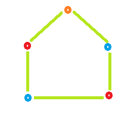

1.Change Of Character
2.Fibonnaci
3.Count Factor-2
4.Colorful Number
        Problem Description

        Given a number A, find if it is COLORFUL number or not.

        If number A is a COLORFUL number return 1 else, return 0.

        What is a COLORFUL Number:

        A number can be broken into different consecutive sequence of digits. 
        The number 3245 can be broken into sequences like 3, 2, 4, 5, 32, 24, 45, 324, 245 and 3245. 
        This number is a COLORFUL number, since the product of every consecutive sequence of digits is different

        Problem Constraints

        1 <= A <= 2 * 109

        Input Format

        The first and only argument is an integer A.

        Output Format

        Return 1 if integer A is COLORFUL else return 0.

        Example Input

        Input 1:

        A = 23
        Input 2:

        A = 236

        Example Output

        Output 1:

        1
        Output 2:

        0
5.Coloring a Cycle Graph
          Problem Description

                    Given the number of vertices A in a Cyclic Graph.

                    Your task is to determine the minimum number of colors required to color the graph so that no two Adjacent vertices have the same color.

                    A cyclic graph with A vertices is a graph with A edges, such that it forms a loop. See example test case explanation for more details.

                    Problem Constraints

                    3 <= A <= 109

                    Input Format

                    First argument is an integer A denoting the number of vertices in the Cyclic Graph.

                    Output Format

                    Return an single integer denoting the minimum number of colors required to color the graph so that no two Adjacent vertices have the same color.

                    Example Input

                    Input 1:

                    5
                    Input 2:

                    4

                    Example Output

                    Output 1:

                    3
                    Output 2:

                    2

                    Example Explanation

                    Explanation 1:
                    

                    
                    Color required = 3
                    Explanation 2:
                    
                    
                    Color required = 2

                    Expected Output
                    Provide sample input and click run to see the correct output for the provided input. Use this to improve your problem
                    
6.Reversing Elements Of Queue